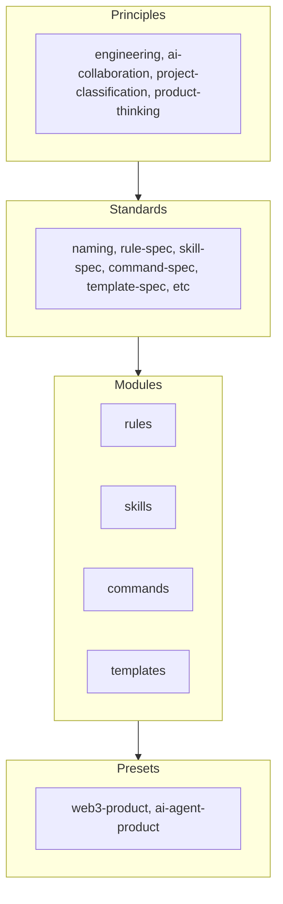

# Team Playbook

Modular knowledge assets for teams: rules, skills, commands, templates, and presets. An **engineering OS** that humans and AI agents can consume and extend.

## 3-Step Setup

1. **Clone** this repo (or add as submodule).
2. **Choose a preset** and copy the config:
   ```bash
   cp playbook.example.yaml /path/to/your-project/playbook.yaml
   ```
3. **Edit** `playbook.yaml`: set `playbook.preset`, adjust `include/exclude/overrides`.
4. **Sync into project**:
   ```bash
   pnpm playbook sync
   ```

Minimal `playbook.yaml`:

```yaml
playbook:
  preset: web3-product
  include:
    rules: [backend-rest-style]
```

## Structure



| Layer | Path | Purpose |
|-------|------|---------|
| Principles | `principles/` | Decision rules, team consensus |
| Standards | `standards/` | Format specs for modules |
| Modules | `modules/` | Atomic rules, skills, commands, templates |
| Presets | `presets/` | Curated combinations for project types |
| Registry | `registry/` | Machine-readable index (built from modules) |

## Contributing

Add modules, improve presets, or update principles. See [CONTRIBUTING.md](CONTRIBUTING.md).

## Scripts

| Command | Purpose |
|---------|---------|
| `npm run validate` | Check meta.yaml, preset refs |
| `npm run build-registry` | Rebuild `registry/index.json` |
| `pnpm playbook sync` | Resolve playbook.yaml and sync outputs into project |
| `npm run sync-preset <name>` | Legacy入口，内部委托到新 `playbook sync` 逻辑 |

Details in [CONTRIBUTING.md](CONTRIBUTING.md).

## AI / Agent Consumption

`registry/index.json` provides full module metadata and `path` for resolution. See [registry/README.md](registry/README.md) for the consumption contract.
