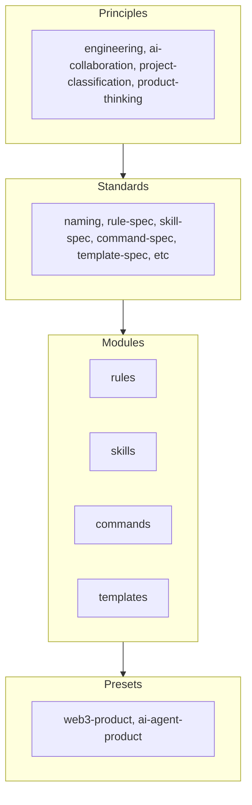

# Team Playbook

A modular knowledge asset repository for team experience: skills, commands, rules, templates, and presets. Not a doc heap—an **engineering OS** that humans and AI agents can consume and extend.

## Quick Start

```bash
git clone <this-repo>
cd Team-Playbook
npm install
npm run validate
npm run build-registry
```

Copy `playbook.example.yaml` to your project as `playbook.yaml`, set `preset: web3-product` or `preset: ai-agent-product`, add overrides as needed.

## Why This Repo Exists

- **Humans**: Read and contribute. Use principles, standards, and modules as reference.
- **AI / Cursor**: Parse structured content. Use `registry/index.json` for discovery. Each module has `path` for file resolution.
- **New projects**: Consume via `playbook.yaml` and presets. Sync only what you need.

## Structure



| Layer | Path | Purpose |
|-------|------|---------|
| Principles | `principles/` | Decision rules, team consensus |
| Standards | `standards/` | Format specs for modules |
| Modules | `modules/` | Atomic rules, skills, commands, templates |
| Presets | `presets/` | Curated combinations for project types |
| Registry | `registry/` | Machine-readable index (built from modules) |

## Adding a Module

1. Pick type: rule, skill, command, or template.
2. Read the spec in `standards/` (e.g. `rule-spec.md`).
3. Create `modules/<type>/<id>/` with `meta.yaml` and `README.md`.
4. Run `pnpm validate` (or `npm run validate`).
5. Open a PR.

See [CONTRIBUTING.md](CONTRIBUTING.md) for details.

## Using a Preset

1. Copy `playbook.example.yaml` to your project as `playbook.yaml`.
2. Set `preset: web3-product` or `preset: ai-agent-product`.
3. Add overrides (add/remove modules) as needed.

```yaml
preset: web3-product
overrides:
  rules:
    add: [backend-rest-style]
```

## Scripts

| Command | Purpose |
|---------|---------|
| `pnpm run validate` or `npm run validate` | Check meta.yaml, id=dir, preset refs |
| `pnpm run build-registry` or `npm run build-registry` | Rebuild `registry/index.json` and `search-index.json` |
| `pnpm run sync-preset <name>` | Stub; future: copy/link modules into target project |

## AI / Agent Consumption

- `registry/index.json`: Full module metadata including `path` (e.g. `modules/rules/git-branching`)
- `registry/search-index.json`: Lightweight index for tag/summary search
- Resolve preset: merge `required` + `overrides.add` - `overrides.remove` from preset.yaml

## Roadmap

- **sync-preset**: Implement copy/link of preset modules into target project.
- **CI**: Run validate and build-registry on PR.
- **Search**: Use search-index for tag/summary search (CLI or API).
