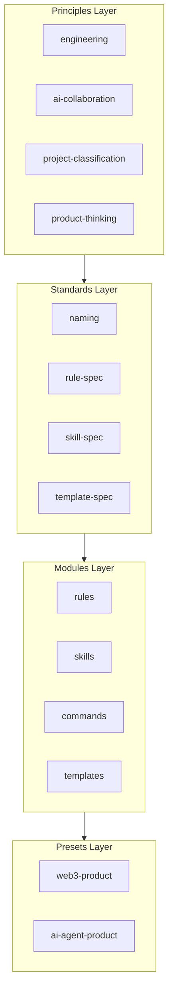

# Architecture

## Layer Model

- **Principles**: Decision rules and team consensus. Rarely change.
- **Standards**: Format specs for modules. Define how to write and validate.
- **Modules**: Atomic, reusable units. Each has meta.yaml and content.
- **Presets**: Curated combinations for project types. Consumed via playbook.yaml.
